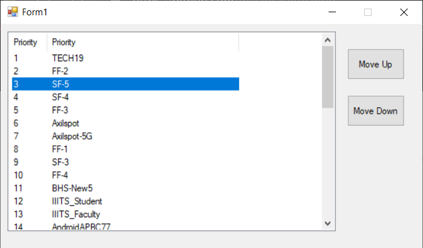

# SetNP
**Set** **N**etwork **P**riority is a Windows Desktop Application 
which can be used to change priorities of Wi-Fi connection on Windows 7+ 
in which Wi-Fi network is selected when multiple networks.
It is really annoying when Wi-Fi get automatically changed to a bad network,
use this application to fix that.
## Usage
 * Run the program
 * Select the network
 * Move priorities Up or Down
  

